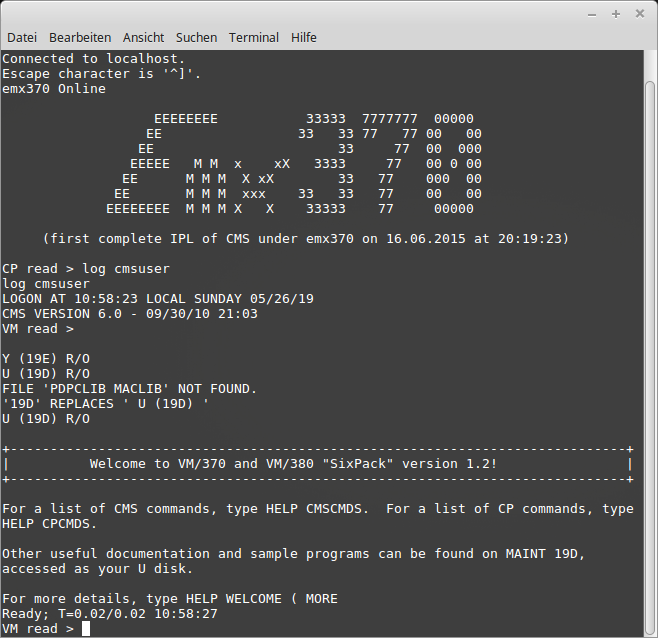
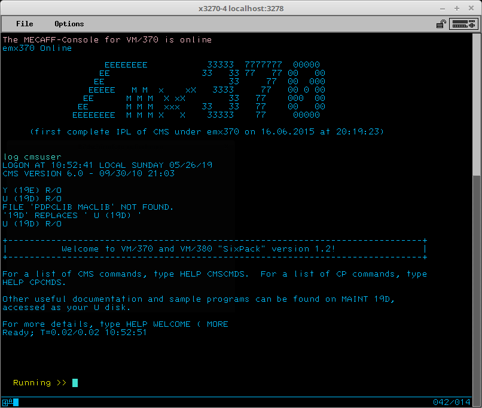
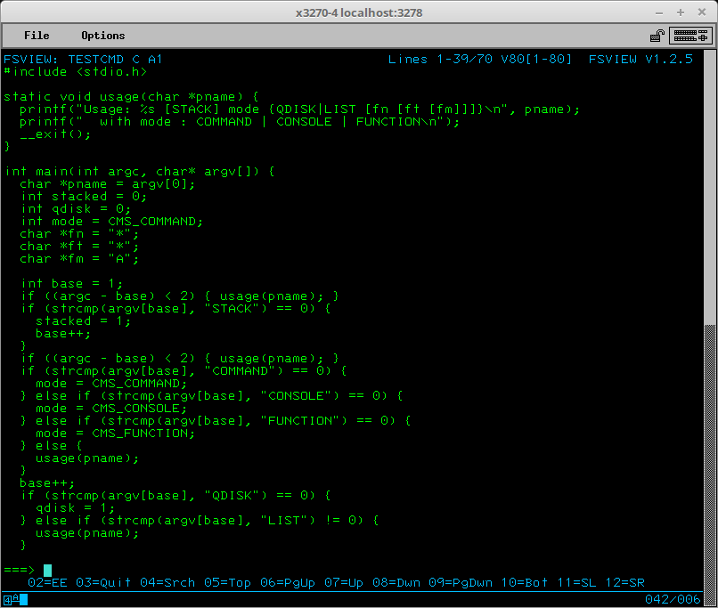
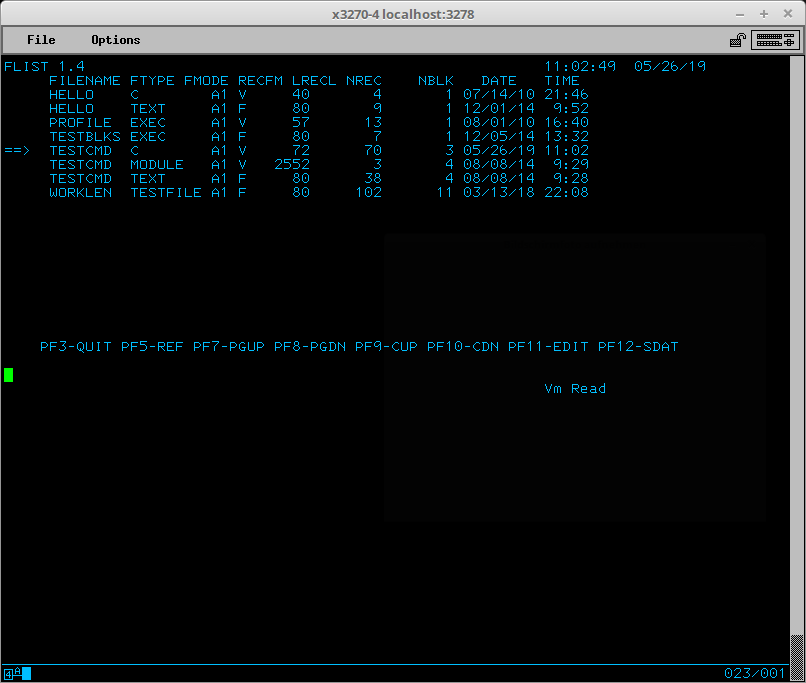

## emx370

### Overview

The emx370 allows to run the CMS operating system of VM/370-R6 from 1978 in an environment simulating
the inside view of virtual machines as provided by the CP (control program) of a VM/370 system.    

This simulation is implemented in **Java 8** and provides the environment necessary for the vintage OS to
IPL and run programs.

Such a virtual machine consists of:

- a S/370 CPU, simplified for running in BC mode without DAT and Control Registers; this CPU implements almost
all problem state instructions as defined by S/370 PrincOps of 1975 (chapters _General Instructions_, 
_Decimal Instructions_, _Floating-Point Instructions_, except _extended_ floating-point instructions) along
with some privileged instructions used by CMS (mainly SIO and friends)
- 16 MBytes main Memory
- a command console either in 3215 mode (if connected to a plain telnet terminal) or 3270 mode (if connected to a
3270 terminal emulation) 
- a set of minidisks, either exclusively dedicated to this VM, typically accessed in R/W mode, or shared with
other VMs in R/O mode (like system minidisks)
- optionally one or more tape devices working with AWS files on the external OS where the emulator runs
- optionally a card reader (RDR), a card puncher (PUN) resp. a printer (PRT), each interfacing files on the
external OS
- a CP (Control Program) emulation providing a subset of the CP user commands as well as the low-level
DIAGnose instruction for the virtual hardware interface necessary to use CMS   

Except for shared minidisks, all these resources are owned by exactly one VM, so running 3 VMs simultaneously in
this emulator will allocate 3 CPUs (class instances), 3 x 16 MByte for main memory etc.

Although emx370 is explicitly designed to run CMS in the 1978 vintage (release 6 of VM/370, with the SixPack
improvements), other S/370 or S/360 operating systems may run in the restricted environment supported by emx370,
provided that DAT (dynamic address translation) and control registers are not required by the guest OS.

This excludes more complete OSes (like MVS) needing the full set of S/370 features from running in an emx370
virtual machine, like this would be possible in a true VM/370 (which allows even to run several nested VM/370
instance in a virtual machine).

However older OSes like MFT _may_ run, but this has **not** been tested.

### Running emx370 at a glance

#### CMS software known to run

Although not many software components from VM/370 were tested with emx370, the following software
is known to work in a VM running CMS:

- standard CMS commands like LISTFILE, LOAD, INCLUDE, GENMOD, ...
- pseudo-fullscreen programs like EDIT, FLIST
- real fullscreen programs (from the MECAFF suite) like EE, FSLIST, FSHELP, ...
- ASSEMBLE
- GCC
- PUNCH, READCARD, PRINT

#### Performance

No systematic performance tests were executed. However a simple practical use-case gives hints
about the overall speed of emx370: recompiling the MECAFF system, consisting of ASSEMBLE and C
sources, recompiling all sources with the `FSCOMP` EXEC.

Here are the figures as rounded up average run times of 3 runs (for emx370 after a warm-up run allowing
the Just-In-Time of the Java runtime to have enough class and method usage data):

- 02:24 minutes for Hercules running VM/380 (31-bit version on VM/370)    
with 31 bit GCC compiler

- 02:00 minutes for emx370 with 64 bit Java 8 JRE    
with 24 bit GCC compiler

(all measures under Windows 7 on a Core2Duo 2.4 GHz system)

emx370 is surprisingly faster regarding the overall execution time, but this does **not**
mean that the sheer computing performance of the Java program is better than the C (Hercules)
program.

The advantage for emx370 mostly comes from 2 effects:
- no address translation means one less time consuming step in instruction execution (an address
computed in the instruction directly addresses the 16 MByte memory array instead of going through
additional tables and possibly initiating a swap operation)

- all disk operations execute in memory, without interactions with the backing file on disk    
(this however slows down starting up resp. shutting down virtual machines in emx370)

The overall performance result is: emx370 is sufficiently fast for normal use-cases, but probably
not for computation/CPU intensive tasks.

#### Configuration and data files

The following data files on the external OS are used by emx370:

- virtual minidisk files for emulating CKD-DASD minidisks for CMS    
a single minidisk consists of the base disk file and delta file. Both files have compressed format
holding the CKD data of the DASD. Although a minidisk can be created from scratch, the base disk
file will usually be a minidisk transferred from a real VM/370 installation.
An emx370 VM can have an arbitrary number of minidisks, assigned to virtual CUU addresses.    
The minidisks can be dedicated to a VM (the user disks, usually attached R/W) or shared among
the VMs in the system. Shared disks are always attached R/O to a VM and are used for systems
disks, compilers or the like.

- shared segment files    
emx370 mimics the original shared segment concept of VM/370 for providing prepared main memory
sections for IPL, for preloaded common software or the like. Shared in the emx370 context means that
the segments are R/O for the VMs and are provided for all VMs. Each emx370 having its own
and isolated 16 MByte main memory, there is no sharing at runtime, meaning that the "shared" segments
are simply copied in the main memory when used by a VM.

- tape file    
tape devices can optionally be attached to a emx370 VM, allowing to read and write emulated tape
files in AWS format.

- card files    
the optional RDR and PUN devices of an emx370 VM read and write external data files as card stream,
several formats for these data files (binary, ascii text) are possible

- print files    
the optional PRT device can produce print outputs in various formats (text with several format options,
PS, possibly PDF) depending on the spool class used.

The configuration of emx370 is controlled at 2 levels with command files:

- at global level with a command file defining items for all VMs:
    - the shared minidisks
    - the command for producing PDF from PS

- at VM level with a logon script defining the properties of the VM:
    - shared segments to provide in the VM
    - attach shared minidisks to CUU addresses
    - load and attach private minidisks to CUU addresses
    - attach other devices (PRT, RDR, PUN) with their basic properties
    - optionally IPL the VM  

#### Running the program

The main class for emx370 is:

    dev.hawala.vm370.Emx370

It expects to find the file `emx370.script` in the current directory, this file is the global
level command file. After executing the commands in this file, the programs starts listening
to port `3278` for ingoing TCP/IP connections. 

The program also starts a system console on stdin/stdout, awaiting commands. Although the few commands
possible in `emx370.script` can also be given here, the most important command is `SHUTDOWN`
which forces LOGOFF for all running VMs and terminates the program.

#### Starting a virtual machine
A new session on the emx370 system is started when a new connection is opened to port 3278.
Depending on the terminal emulation connecting to this port (tn3270 emulation or plain telnet)
a 3270 or 3215 console is created which will await the LOGON command for a new virtual machine.

Users need to be defined in the `emx370.password` file and then need to have a logonscript
created in the current directory in the form of `username.logonscript`. Passwords are stored 
case-insensitive. 

If the `emx370.password` file does not exist, no password validation is carried out. Furthermore 
there are no provisions to prevent concurrent logons for the same user.

When the logon script is found, the VM is incarnated by executing the commands in the logon script.

#### Sample system delivered with emx370

The directory `sample-system` contains a complete example system for emx370 including
the `.jar` file with the java binary, shell-scripts, configuration scripts and the necessary
data file for using the CMSUSER virtual machine in a similar fashion as in VM/370 where
the CMSUSER environment was taken.

The directory `cp_shared` holds the shared files, these are the shared segments CMS and CMSSEG,
the system minidisks 190, 19D and 19E as well as the the minidisks with the GCC compiler binaries
491, 201 and 202 of the user GCCCMS:

	CMS.segment
	CMSSEG.segment
	gcccms_201.ckdc
	gcccms_202.ckdc
	gcccms_491.ckdc
	shared_190.ckdc
	shared_19D.ckdc
	shared_19E.ckdc

The directory `cp_cmsuser` contains the minidisks 191..195 for the user CMSUSER that were copied
from the same user on a VM/370 system:

	cmsuser_191.ckdc
	cmsuser_191.ckdc.delta
	cmsuser_192.ckdc
	cmsuser_192.ckdc.delta
	cmsuser_193.ckdc
	cmsuser_193.ckdc.delta
	cmsuser_194.ckdc
	cmsuser_194.ckdc.delta
	cmsuser_195.ckdc
	cmsuser_195.ckdc.delta

These minidisks consist each of the base disk (`.ckdc`) which is the copy from VM/370 and the delta file
(`.ckdc.delta`) containing the changes to the disks made in emx370 sessions. The disks 192 to 194 contain
the sources and binaries for MECAFF and NICOF.   

The file `emx370.script` defines the shared items in the system:

	#
	# initialize script to the emx370 system
	#
	
	# shared MAINT minidisks
	sharedckdc maint 190 cp_shared/shared_190.ckdc
	sharedckdc maint 19D cp_shared/shared_19D.ckdc
	sharedckdc maint 19E cp_shared/shared_19E.ckdc
	
	# shared GCCCMS minidisks
	sharedckdc gcccms 201 cp_shared/gcccms_201.ckdc
	sharedckdc gcccms 202 cp_shared/gcccms_202.ckdc
	sharedckdc gcccms 491 cp_shared/gcccms_491.ckdc

This script defines the shared minidisks for the pseudo-users `MAINT` and `GCCCMS`, allowing
to attach these disks using the CP LINK command, which requires a username and a disk CUU.
For example the `GCC EXEC` for compiling C programs dynamically links and detaches these disks of
user GCCCMS, so the name of the pseudo-user and the device addresses given in the `sharedckdc`
commands matter for successfully using the compiler.

The file `cmsuser.logonscript` defining the user CMSUSER is as follows:

	#
	# logon script for user: CMSUSER
	#
	
	# segments
	:segment CMS IPL 33 0 cp_shared/CMS.segment
	:segment CMSSEG 16 3840 cp_shared/CMSSEG.segment
	
	# card reader
	:rdr create
	
	# puncher
	:pun create cp_cmsuser/puncher_output
	
	# printer
	:prt create cp_cmsuser/printer_output
	
	# dasd minidisks
	:dasdshared 190 maint.190
	:dasdshared 19D maint.19D
	:dasdshared 19E maint.19E
	
	# user owned minidisks
	:dasdload 191 cp_cmsuser/cmsuser_191.ckdc
	:dasdload 192 cp_cmsuser/cmsuser_192.ckdc
	:dasdload 193 cp_cmsuser/cmsuser_193.ckdc
	:dasdload 194 cp_cmsuser/cmsuser_194.ckdc
	:dasdload 195 cp_cmsuser/cmsuser_195.ckdc
	
	# initial program load
	:ipl cms
	
	# that's it

First the script defines the shared segments and where to place them in main memory, marking the
CMS segment as IPL-able. Then it defines the usual devices RDR, PUN and PRT, the last 2 with their
output directories. The system minidisks 190, 19D, 19E are attached from the shared items, then
the script defines the private minidisks of this VM (191 to 195). Finally CMS is IPL-ed to
start the VM.

The commands used in the logon script are so-called emulator commands, which start with a colon
and are used to directly control the setup of the VM. These are in so far like CP commands, but
they know about the hosting (real) OS for binding virtual devices to real files.

The emx370 system can be started with the script (provided the Java 8 JRE is on the PATH)

	emx370.sh

The following show a sample log output to `stdout` with a single user session:

	## Initializing emx370 system
	Loaded shared CKDC with identifier: MAINT.190
	Loaded shared CKDC with identifier: MAINT.19D
	Loaded shared CKDC with identifier: MAINT.19E
	Loaded shared CKDC with identifier: GCCCMS.201
	Loaded shared CKDC with identifier: GCCCMS.202
	Loaded shared CKDC with identifier: GCCCMS.491
	## Starting listener on port 3278
	Accepted connection 0 (line 010, type: 3270)
	CMSUSER: Info: measured CPU performance: 11275 instructions/ms (100000 insns in 8869114 nanosecs)
	VM 'CMSUSER' logged on at 21:45:46 LOCAL FRIDAY 05/17/19
	VM 'CMSUSER' logged off at 22:44:11 LOCAL FRIDAY 05/17/19
	+++ UserConsole3270.shutdown()
	** User session ended by closing input source!
	Closed connection 0 (line 010)

**shutdown confirmed**

	... SHUTTING DOWN THE SYSTEM !!!!!
	## Shutting emx370 system
	## emx370 was successfully shut down, exiting program now.

The command `shutdown confirmed` gracefully terminates emx370.

### Device support

#### I/O functionality

emx370 of course supports the S/370 I/O architecture by interpreting possibly chained CCWs
with the standard and device specific behavior.

It deviates however from the standard architecture as any I/O operation initiated with the SIO instruction
is executed synchronously (similar to the _General I/O_ DIAG X'20' instruction), in the sense that
when the SIO instruction is done, all memory transfers have been executed and a possibly generated
interrupt is already notified and will be processed as soon as possible.

Or in other words: no parallel I/O operations, no I/O operations while the CPU executes. This
simplifies synchronizing memory accesses between the CPU and I/O devices: no synchronization
necessary.

#### Console

When a connection is opened to port 3278, emx370 starts the tn3270 initialization handshake. If
the connected terminal accepts it, a 3270 user console is created, else a 3215 console. The console
controls the interactions of the user with the VM, accepting input from the connected terminal,
forwarding the input to the VM for processing and sending output generated by the VM for 
display.

##### 3215 user console

The 3215 console supports only the simple interaction of input line based entering of commands
and line based output.

The  editing possibilities supported by emx370 when entering an input line are rather primitive:
the backspace key is the only editing function supported.

As serial console type, the 3215 console does not support fullscreen interactions.

The following screenshot shows an example of an emx370 session with a 3215 console.

##### 3270 user console

emx370 integrates the MECAFF console as 3270 user console. The MECAFF console was initially an external
program to VM/370 under Hercules, which was taken unmodified as console implementation for emx370.

The MECAFF console supports a line oriented terminal interaction allowing to scroll back and forth in
up to 65536 output lines and supporting fullscreen operations through the DIAG X'58' instruction.
By this it mixes a Unix-like command-response interaction with 3270 fullscreen interaction for programs
requiring control over all terminal lines. The user console supports standard 3270 screen sizes (3270 model
2 to 5) and arbitrary oversizes.

The following screenshot shows an emx370 user session in the x3270 terminal emulation with
87 columns x 43 lines screen size:

The next screenshot is the emx370 session in fullscreen mode:

 

Beyond "native" 3270 fullscreen applications, the 3270 console also supports the "old" DIAG X'58'
interface (CCW code X'19'), which was the only available access to the 3270 screen up to VM/370-R6,
allowing to write (only) to the first 22 lines of the screen, but not allowing to define or handle
input fields.    
This limited screen interaction is supported by an internal (Java) fullscreen application which
simulates the CP console screen layout for 3270 terminals. This simulation is entered with a DIAG X'58'
with CCW code X'19', keeps control over the screen as long as output is made through DIAG X'58'
with CCW code X'19' and ends with the first serial console output.    
This allows programs like `EDIT`or `FLIST` to work as in the original VM/370-R6, as for
example in the following screenshot showing `FLIST`:

#### Minidisk / CKD-DASD

emx370 supports both CKD and FBA disks, but only the implementation for CKD can be considered
mature and usable. The FBA disk implementation is rather simplistic (no compression, delta file
is in fact the full disk) and possibly unreliable, as no real tests were possible (CMS from VM/370
cannot handle FBA disks, but OSes knowing this disk type are probably too advanced for emx370).    
For this reason, "minidisk" means "CKD disk".

Minidisks in emx370 are not cylinder a range in a more or less real DASD disk, instead
each minidisk is a device by its own. However CMS does expect a minidisk to be part of
a real disk type like 3330, 3350 etc., as this type defines the characteristics of a
cylinder like the number of heads or the raw data length of a track.

For this reason, emx370 minidisks have a CKD disk type and a cylinder count ranging from 1 to
the max. count supported by CMS for this device type (limited by the max. number of blocks
supported for a minidisk).

All CCW disk operations and operation codes (flags) used for CKD disks like 3350 are supported, meaning
that minidisks can not only be read and written, but can also be formated or IPL-ed from.

The complete content of the minidisk is loaded into (Java) memory from the compressed base- and
delta-files when a disk is used. All write operations change only this memory image. Changes to the
disk are written to the delta-file for the minidisk when the minidisk is detached from the VM,
either explicitly with the CP `DETACH` command or implicitly when the VM is logged off (which
also detaches the minidisks). 

#### Tape

emx370 implements an 3420 type tape device allowing to read and write tape files in AWS format.
Except for reverse reading blocks, all relevant CCW operations and operation codes are supported.

The tape file content is completely loaded into (Java) memory as list of tape blocks when mounted
into the tape device and all tape manipulations occur in memory.    
If the tape content was changed, the AWS tape file will be overwritten (or created)
with the new tape content when the tape is dismounted from the tape device (`TAPE RUN`, another
tape file is mounted or created) or when the tape device is detached from the VM.

#### Printer

The printer device of emx370 emulates a 1403 printer which creates printouts as files in a
configured target directory.

The name of the generated file in the target directory will be:

`prt_nnn.ext`    
or    
`prt_nnn_fn_ft.ext`

where _ext_ is the format specific extension (see below) and _nnn_ a unique numeric string; if
available from the print job, _fn_ and _ft_ of the printed file will be added to the resulting
file name.

The format of the output file can be controlled for each print job (range of CMS `PRINT` commands
finalized with a CP `CLOSE` command) by setting the spool class for the printer with the
CP `SPOOL` command.

The spool class values (single character A to Z or digit 0 to 9) have the following mapping to the
output formats:

Class|Format|Extension|Greenbar underlay|Box char mapping|Page format
-----|---------------|------|-------|-------|----------------------------------------------
A    | ascii, ascii control|.txt|no|no|arbitrary line length, page size 66 lines
B    | ascii, ASA control|.txt|no|no|arbitrary line length, page size 66 lines
C    | PostScript|.ps|yes|no|portrait page (line length 80 chars, page size 66 lines)
D    | PostScript|.ps|yes|no|landscape page (line length 132 chars, page size 66 lines)
E    | PostScript|.ps|no|no|portrait page (line length 80 chars, page size 66 lines)
F    | PostScript|.ps|no|no|landscape page (line length 132 chars, page size 66 lines)
G    | PDF|.pdf|yes|no|portrait page (line length 80 chars, page size 66 lines)
H    | PDF|.pdf|yes|no|landscape page (line length 132 chars, page size 66 lines)
I    | PDF|.pdf|no|no|portrait page (line length 80 chars, page size 66 lines)
J    | PDF|.pdf|no|no|landscape page (line length 132 chars, page size 66 lines)
0    | PostScript|.ps|yes|yes|portrait page (line length 80 chars, page size 66 lines)
1    | PostScript|.ps|yes|yes|landscape page (line length 132 chars, page size 66 lines)
2    | PostScript|.ps|no|yes|portrait page (line length 80 chars, page size 66 lines)
3    | PostScript|.ps|no|yes|landscape page (line length 132 chars, page size 66 lines)
4    | PDF|.pdf|yes|yes|portrait page (line length 80 chars, page size 66 lines)
5    | PDF|.pdf|yes|yes|landscape page (line length 132 chars, page size 66 lines)
6    | PDF|.pdf|no|yes|portrait page (line length 80 chars, page size 66 lines)
7    | PDF|.pdf|no|yes|landscape page (line length 132 chars, page size 66 lines)
other letter| ascii, ascii control|.txt|no|no|arbitrary line length, page size 66 lines
other digit| ascii, ascii control|.txt|no|yes|arbitrary line length, page size 66 lines

Line and page control can be either _ascii control_, meaning that ascii control chars `CR`,
`LF`and `FF` are used for formatting, or _ASA control_, meaning that the first column
is reserved for the ASA format characters (`1` for forward to next page, `+` for
line overwrite etc.). _PostScript_ has a specific layout mechanism by explicitly placing
text on pages. Output format _PDF_ is first created as _PostScript_ and then postprocessed
to PDF by the command defined with the global emulator command `PS2PDFCOMMAND`; if none
is defined or it it cannot be executed successfully, _PDF_ falls back to _PostScript_ (even for
a successful postprocessing, the generated `.ps` will not be deleted).

If _Greenbar underlay_ is _yes_, then printing on old style paper with alternating
horizontal white and light green stripes will be simulated.

If _Box char mapping_ is _yes_, some pseudo-graphic EBCDIC characters will be replaced by
similar characters (corners as `+`, vertical line as `|`, horizontal line as `-`). 

#### Card reader

emx370 emulates a 2504 card reader for reading card decks from external files. The possible
input files are enqueued for a specific spool class (class `A` by default, see emulator command `:RDR`).
The reader device will process the files by selecting those matching the class specified by the
last CP `SPOOL RDR` command, the default spool class is `*`.

#### Card punch

emx370 emulates a 2504 card puncher for writing card decks as files in a configured target directory.

The output encoding depends on the current spool class for the PUN device: a numeric spool class
`0` to `9` will produce card deck files in ebcdic (or binary) encoding, letter (`A`to `Z`) spool
classes will produce ascii files. 

The name of the generated file in the target directory will be:

`pun_nnn.ext`    
or    
`pun_nnn_fn_ft.ext`

where _ext_ is `txt`for ascii and `data`for ebcdic output files and _nnn_ a unique numeric string; if
available from the punch job, _fn_ and _ft_ of the punched file will be added to the resulting
file name.

### Transferring disk data from VM/370 to emx370

Data can easily copied between a VM/370 system (e.g. running under the Hercules emulator) and
an emx370 system using AWS tapes and CMS commands for reading resp. writing tapes (`TAPE`,
`VMFPLC2`, `MOVEFILE`). As tapes are fully supported in emx370, this works for data
transfers in both directions directly from virtual machines in both systems, provided a running
emx370 system is available.

When setting up a new emx370 from scratch, more is needed than simply copying files with
tapes, as at least empty emx370 minidisks and the IPL-able shared segments must be present
(or as an alternative at least a complete (meaning IPL-able) 190 minidisk) are needed to start
an emx370 virtual machine capable to read a tape.

The utility program `Vm370DdrCkdcLoader` was created for setting up minidisks or segments for
an emx370 system. The following sections describe this program.

#### Utility program Vm370DdrCkdcLoader

The main class of the program is

	dev.hawala.vm370.dasd.ckdc.Vm370DdrCkdcLoader

This program can be invoked more easier with the script `emx370-ckdc.sh` (provided the
Java8 JRE is on the `PATH`).

It accepts the following command line parameters:

`-create dev-type cyl-count volser outfilename`    
for creating a new and empty minidisk

`-import aws-tapefile outfilename`    
for creating a minidisk from an AWS type file written from CMS with the `DDR` utility

`-savedsegment aws-tapefile outfilename [CP-pagecount]`    
for creating a shared segment file from an AWS type file written from CMS with the `DDR` utility

#### Create an empty minidisk

The utility can create minidisks of various types with the command line option

`-create dev-type cyl-count volser outfilename`    

The `dev-type` parameter controls the type of DASD disk to create, the following types are supported:
- `2305` (heads: 8, tracklen: 14568 bytes)
- `2305-2` (heads: 8, tracklen: 14568 bytes)
- `2311` (heads: 10, tracklen: 3625 bytes)
- `2314` (heads: 20, tracklen: 7294 bytes)
- `3330` (heads: 19, tracklen: 13165 bytes)
- `3330-2` (heads: 19, 13165 bytes)
- `3340` (heads: 12, tracklen: 8535 bytes)
- `3340-2` (heads: 12, tracklen: 8535 bytes)
- `3350` (heads: 30, tracklen: 19254 bytes)
- `3375` (heads: 12, tracklen: 36000 bytes)
- `3380` (heads: 15, tracklen: 47968 bytes)

`cyl-count` defines the number of cylinders to create the minidisk with.

`vol-ser` denotes the label for the new disk.

If necessary the extension `.ckdc` (for CKD compressed) will be appended to the filename
`outfilename` for the disk.

The new minidisk can be attached to an emx370 virtual machine and must be initialized in
CMS with command `FORMAT`.

#### Transferring minidisks from VM/370

Minidisk dumps created on tape with the DDR utility can be used to create an equivalent
minidisk for emx370 with the command line option:

`-import aws-tapefile outfilename`

The tape file with the DDR dump to import is given by `aws-tapefile`, the base-file for the
minidisk to create is given by `outfilename` (possibly with an added extension `.ckdc`).

The minidisk created will have the same DASD type (3350 etc.) and will have the same structure
and content as the original disk in VM/370.

A usable DDR dump for a minidisk can be created in VM/370-R6 as follows:

- if necessary attach and access the minidisk

- query the number of cylinders and the dasd type of minidisk with `QUERY DISK`

- mount a fresh tape file to the tape device and attach it as 181

- enter the DDR command and enter the following lines to the `ENTER` prompts from DDR:    
`input` _cuu_ _dasdtype_    
`output  181 3420`    
`dump all`

- DDR will then ask if the VOLID (label) is correct; if it is, answer with `yes`

- after dumping the minidisk, DDR will issue another `ENTER` prompt, entering an empty line
will terminate DDR

Example for dumping the disk 195 of type 3350 (input is lower-case, system output upper-case):

    TAPE 181 ATTACHED
    ddr
    VM/370 DASD DUMP/RESTORE PROGRAM RELEASE 6
    ENTER:
    input 195 3350
    ENTER:
    output 181 3420
    ENTER:
    dump all
    DMKDDR711R VOLID READ IS CMS195
    DO YOU WISH TO CONTINUE?  RESPOND YES NO OR REREAD:
    yes
    DUMPING   CMS195 IN(195)  OUT(181)  ALT(181)
    END OF DUMP
    ENTER:
    
    
    END OF JOB
    Ready; T=0.09/3.00 08:32:38

#### Transferring shared segments from VM/370

DDR dumps containing a shared segment from VM/370 can be imported with the command line option

`-savedsegment aws-tapefile outfilename [CP-pagecount]`

The tape file with the DDR dump to process is given by `aws-tapefile`, the file to
store the segment is denoted by `outfilename`. The length of the shared segment in pages
(of 4096 bytes) is given with `CP-pagecount`; if not given, then all pages in the DDR tape will
be used. As DDR always dumps whole cylinders, omitting this parameter is not recommended, as the
segment created will be too large and may no fit in the VM's main memory at the load point. The correct
page size should therefore always be given.

Creating a DDR dump tape for a shared segment is more complicated than for minidisks, as this enters
the domain of system programming. The key point is to get the necessary information about what to dump.

The shared segments are defined in the assembler module `DMKSNT` for CP (owned by user `MAINT`) using
the macro `NAMESYS`.

Each segment is defined with an own macro instance, the relevant macro arguments are
- `SYSNAME`    
identifies the segment
- `SYSVOL`    
the label of the real disk containing the segment
- `SYSSTRT`    
giving the start cylinder for the segment in `SYSVOL` (first value in parentheses)
- `SYSPGCT`    
segment length in pages (page count); this is the value for `CP-pagecount` and is to be given
as `page-count` to the `:SEGMENT` command registering the segment to a VM in the login script
- `SYSPGNM`    
location of the segment in main memory when activated, as from / to page values in parentheses;
the first is the value to be given as `load-at-page` to the `:SEGMENT` command registering
the segment to a VM in the login script

The number of cylinders to dump results from the number of CP pages in the segment (`SYSPGCT`)
and the number of CP pages per cylinder, which depends on the DASD type of the disk where the
the segment is saved. A 3350 DASD (used in VM/370 Sixpack 1.2) has 90 CP pages per cylinder
(3 CP pages per track and 30 tracks per cylinder). So segments with up to 90 pages need 1 cylinder
to dump, from 91 to 180 need 2 cylinders to dump etc.

In the Sixpack 1.2 version of VM/370, all segments are stored on `SYSVOL` = `VM50-1`, which is at
real address 141. This complete disk is available to user `MAINT` as virtual minidisk 231, so this
user can create the dump from a running VM/370 system (and no need to ipl a DDR tape!), see the file
`SIXPACK DIRECT A` from user `MAINT`.

**Example:**

The segment `CMS` is defined in VM/370 Sixpack 1.2 with the following values for the above parameters:

    SYSVOL=VM50-1 SYSSTRT=(001,1) SYSPGCT=33 SYSPGNM=(0-32)

So the segment `CMS` is 33 CP pages long and is to be located at page 0 in the virtual machines
main memory. With 33 pages, 1 cylinders must be dumped, starting at cylinder 001 of volume `VM50-1`
which is at real address 141 and for user `MAINT` at virtual address 231.

Dumping a segment with DDR is similar to dumping a minidisk, but specifying the segment's
cylinder range with the subcommand `dump` (instead of `all`, which would dump the whole real disk).

The following is a sample session for user `MAINT` for dumping the segment `CMS` with a tape
already attached to 181:

    ddr
    VM/370 DASD DUMP/RESTORE PROGRAM RELEASE 6
    ENTER:
    input 231 3350 VM50-1
    ENTER:
    output 181 3420
    ENTER:
    dump 001 to 001
    ENTER NEXT EXTENT OR NULL LINE
    ENTER:
    
    
    DUMPING   VM50-1 IN(231)  OUT(181)  ALT(181)
    END OF DUMP
    ENTER:
    
    
    END OF JOB
    PRT FILE 1355  TO  MAINT    COPY 01 NOHOLD
    Ready; T=0.01/0.15 08:21:10

### Global emulator commands

Global emulator commands can be given both in the global configuration script `emx370.script`
and on the system console on stdin/stdout of the emx370 program.

The following are the "official" global emulator commands (one more is for development purposes):

`SHAREDCKDC username cuu basefile-spec`    
define a shared minidisk owned by the pseudo-user _username_ having virtual address _cuu_ on this
user, loading the disk content from `basefile-spec` (and the possibly assiciated delta file);
this shared minidisk can be either attached with the `:DASDSHARED` command using the identifier
`username`.`cuu` or with the CP command `LINK`.

`PS2PDFCOMMAND ps2pdf-command`    
define the command on the local OS for creating a PDF file from a PS file; this command will
be used when printing a spool class targeting PDF; the default value is: `ps2pdf`

`SHUTDOWN`    
gracefully stop the emx370 system, first forcing logoff for all running virtual machines; the
command alone will not work unless the magic word `CONFIRMED` (exactly) is added.

### Emulator commands in a virtual machine

Emulator commands are used both to define the structure of the virtual machine
and to control devices attached to the VM, e.g. mount a AWS file in a tape device
or enqueue a file to the card reader.

In most cases, the commands can be used both in the logonscript and at runtime as command to  the VM.
To avoid tokenization to 8 character chunks by CMS or in EXECs, emulator commands should be entered
at the `CP READ` prompt. Furthermore entering emulator commands on the `RUNNING` or
`VM READ` prompt will convert the input to upper-case, which will invalidate filenames
given as parameters to emulator commands.

Most emulator commands do not give feedback if successfully executed. Exceptions are some
emulator commands that correspond to CP commands, which will produce the same messages as the
CP command (e.g. `TAPE 181 ATTACHED`). Otherwise only error messages will be issued by
emulator commands.

The following lists the "official" emulator commands (some more commands are available
for debugging purposes, see the sources).

`:CONS PF nn [cmd...]`    
3270 user console: set or reset the command associated with PF key _nn_
(see the MECAFF `FSCTL` command)

`:CONS FLowmode ON|OFf`    
3270 user console: activate (_ON_) or deactivate (_OFF_) the flowmode of the console,
meaning that the console will not wait for ENTER key with a `More...` prompt when a
screen height of output has been written, meaing that all output flows through the
console. The flowmode ends automatically when running a fullscreen program.
(see the MECAFF `FSCTL` command)

`:CONS ATtr NORMal|ECHOinput|FSBG|CONSolestate|CMDInput Default|Blue|Red|Pink|Green|Turquoise|Yellow|White [HIGHLight]`    
3270 user console: set the display attributes for the output components of the console
(see the MECAFF `FSCTL` command)

`:RDR CREate`    
 create the optional reader device and attach it to the CMS default address `00C`
 
`:RDR ENQueue [ [ASCii] [LENgth n] [TRUNCate] | EBCdic [ZEROfill] ] [CLass c] filename`    
add the file _filename_ to the queue of pending card decks for class _c_ (default: `A`) for the card
reader device, with the following attributes for the deck:
  - _ASCII_ or _EBCDIC_    
  encoding of the input file, only one of these values may be given; _EBCDIC_ corresponds to binary reading
  of the input file    
  default: ASCII
  - _LENGTH n_    
  nominal length of a card in positions; in _EBCDIC_ mode a new card is started after _n_
  bytes read from the file; in _ASCII_ mode a card ends at a newline or after _n_ bytes, whichever comes first    
  default: 80
  - _TRUNCATE_    
  when a card is ended after the nominal length in _ASCII_ mode: do not start a new card with the rest of the line?
  - _ZEROFILL_    
  if the last card in _EBCDIC_ mode does not have the nominal length: fill with zeros up to nominal length?
 
`:PRT CREate directory`    
create the optional print device and attach it to the CMS default address `00E`; output
files created by the printer will be written to _directory_

`:PUN CREate directory`    
create the optional print device and attach it to the CMS default address `00D`; card deck
files created by the puncher will be written to _directory_

`:TAPe cuu ATTach`    
create a tape device and attach it to address _cuu_. _cuu_ should be in range 181 to 184 for being
usable with the CMS `TAPE` command

`:TAPe cuu MOUnt [WITHRing|WRitable] filename`    
mount the existing AWS file _filename_ on the tape device at address _cuu_, creating the
tape device at this address if necessary; the tape is mounted R/O by default, specifying
`WITHRING`or `WRITABLE`mounts the tape file R/W.    
The _filename_ can be given with path, absolute or relative to the start directory
of the emx370 program

`:TAPe cuu CREate filename`    
create a new AWS tape file _filename_ and mount it R/W to the tape device at address _cuu_, creating the
tape device at this address if necessary

`:TAPe cuu DISmount`    
dismount the tape file from the tape device at address _cuu_, saving changes to the currently mounted
AWS tape file to disk if necessary

`:TAPe cuu INFo`    
output some information about the tape mounted on the tape device at address _cuu_ 

`:DASDLOAD [READONLY|RO] cuu basefile-spec`    
create a DASD minidisk with the data-file _basefile-spec_ (with the associated delta file)
at device address _cuu_; the disk will be R/O if _READONLY_ or _RO_ is specified

`:DASDSHARED cuu shared-identifier`    
attach the shared disk _shared-identifier_ (given as _username_._nnn_) to this VM at device address _cuu_

`:SYNC [cuu]`
synchronize the changes on minidisk _cuu_ or all minidisks (if _cuu_ is omitted) to their
respective delta file

`:SEGMENT name [IPL] page-count load-at-page file-spec`  
define the shared segment _name_ for this virtual machine; the content of the segment is
read from the file _file-spec_, is _page-count_ pages long and will be loaded at page
_load-at-page_ into the memory of the VM; if _IPL_ is given, this segment can IPL-ed
by giving its name on the CP command `IPL` or the emulator command `:IPL`

`:IPL segment|cuu [RESet] [NORun]`    
ipl the VM from the named segment _name_ or from device _cuu_; parameters `RESET` and `NORUN`
work as for the CP command `IPL`

`:TIMERintr ON|OFf`    
enable (_ON_, default) or disable (_OFF_) the interval timer; this command is only meaningful
if the virtual machine is not running before going an IPL for an OS that cannot run with
the interval timer on; CMS from VM/370-R6 however needs the interval timer on at IPL or it will stop
during IPL; this means that the default value _ON_ is required for CMS

`:Help`    
output the list of emulator commands
 

### Supported VM/370 CP command subset 

The subset of CP commands supported by emx370 is mainly determined by the commands explicitly
or implicitly required to work with the devices, for example some CMS commands issue CP
commands through the DIAG X'08' interface while doing their work.

Some commands accept more options than allowed by a real CP in some situations, e.g. the emx370 `SPOOL`
command accepts the same options for all devices (`PRT`, `PUN`, `RDR`) although some
options are meaningless for some device: the device will ignore exceeding options.

Lines executed as CP commands and starting with a colon are handled as emulator commands. 

The following lists the supported CP commands in the usual notation.

`Logon username`    
`LOGIn username`    
log on and start the virtual machine _username_    
(only when the VM is not started)

`LOGoff [NOSYnc]`    
`LOGout [NOSYnc]`    
stop the VM and sign off    
if _NOSYNC_ is given, changes to the minidisks are **not** saved to the delta file,
i.e. all changes to disks are discarded

`Query Time`    
output the current time

`Query PF[nn]`    
output the current definition of PF key _nn_ or all PF keys for the CP console simulation

`Query USERID`    
output the own userid (name of the VM)

`Query [Virtual] [ALL|[COns|DAsd] cuu]`    
list characteristics of a specific or all devices

`SET EMSG ON|OFF|CODE|TEXT`    
set handling of error messages

`SET PFnn ...`    
set definition of PF key _nn_ for the CP console simulation

`SPOOL PRT|00E|PUN|00D [CLass c] [COnt|NOCont] [HOld|NOHold] [COpy n]`    
set the spool properties of the printer (PRT,00E) or the card punch (PUN,00D) device

`SPOOL RDR|00C [CLass c|*] [COnt|NOCont] [HOld|NOHold] [EOF|NOEof]`    
set the spool properties of the card reader (RDR,00C) device

`CLOSE  PRT|00E|PUN|00D [PUrge] [HOld|NOHold] [DIst distcode] [Name name]`    
close the current spool output to printer or card punch (possibly initiating postprocessing)

`CLOSE RDR|00C`    
close the card reader input file (ignored as card sources auto-close)

`TERMinal MODE VM|CP`    
set the interrupt mode for the console, as interrupt to VM (VM READ) or interrupt to CP (CP READ)

`DEfine STORage nnM|nnK`    
set the (simulated) main memory size available to the OS running in the VM; this defines
the value returned by DIAG X'60' (_Determine the Virtual Machine Storage Size_), a emx370
VM has always 16 MByte addressable main memory

`LINK [To] user cuu [As] cxx [mode] [[PASS=]password]`    
attach the minidisk _cuu_ of user _user_ to the VM as device _cxx_ (_mode_ and _password_
are ignored)    
the minidisk _user_._cuu_ must be defined as shared disk

`DETach cuu`    
detach a device from the VM

`Begin`    
proceed executing the VM

`Ipl name|cuu [RESet] [NORun]`    
ipl the VM from the named segment _name_ or from device _cuu_

### Relevant bibliography

The following documents available at [Bitsavers](http://www.bitsavers.org/) were
used when developing emx370 (some more were probably forgotten):

- S/370 Principles of Operation (1975)    
[GA22-7000-4_370_Principles_Of_Operation_Sep75.pdf](http://www.bitsavers.org/pdf/ibm/370/princOps/GA22-7000-4_370_Principles_Of_Operation_Sep75.pdf)

- Shared Segments    
[GC20-1807-7_VM370_System_Programmers_Guide_Rel_6_4-81.pdf](http://www.bitsavers.org/pdf/ibm/370/VM_370/Release_6/GC20-1807-7_VM370_System_Programmers_Guide_Rel_6_4-81.pdf),
pp. 132++

- CKD DASD drives, e.g. 3340    
[GA33-1510-1_IBM_System_370_Model_115_Functional_Characteristics_Jul76.pdf](http://www.bitsavers.org/pdf/ibm/370/funcChar/GA33-1510-1_IBM_System_370_Model_115_Functional_Characteristics_Jul76.pdf),
pp. 136.1 .. 156

- FBA DASD drives, e.g. 3310    
[GA26-1660-1_3310_Direct_Access_Storage_Reference_Mar79.pdf](http://www.bitsavers.org/pdf/ibm/dasd/3310/GA26-1660-1_3310_Direct_Access_Storage_Reference_Mar79.pdf)

- 1403 printer    
[A24-3510-0_360-25_funcChar_Jan68.pdf](http://www.bitsavers.org/pdf/ibm/360/funcChar/A24-3510-0_360-25_funcChar_Jan68.pdf),
pp. 39++

- 2504 card reader and punch    
[A24-3510-0_360-25_funcChar_Jan68.pdf](http://www.bitsavers.org/pdf/ibm/360/funcChar/A24-3510-0_360-25_funcChar_Jan68.pdf),
pp. 111++

- 3420 tape drive    
[GA33-1510-1_IBM_System_370_Model_115_Functional_Characteristics_Jul76.pdf](http://www.bitsavers.org/pdf/ibm/370/funcChar/GA33-1510-1_IBM_System_370_Model_115_Functional_Characteristics_Jul76.pdf),
pp. 167.1++

### History

emx370 was developed as a hobby project from autumn 2014 for about 2 years, starting a while after
my last development contribution for the "real" VM/370-R6 (NICOF) and abandoned in favor for the
Xerox Mesa machine emulation adventure (Dwarf).

Uploading this project is to Github a way to give it a chance for a new life, as there
won't probably be any further developments on emx370 or for VM/370 in general from my side.

However ... _never say never again_

### License

The emx370 software is provided "as is" in the hope that it will be useful,    
with no promise, commitment or even warranty (explicit or implicit)    
to be suited or usable for any particular purpose.    
Using this software is at your own risk!    

Written by Dr. Hans-Walter Latz, Berlin (Germany), 2015-2016.

The emx370 binaries and sources are released to the public domain.

### Disclaimer

All product names, trademarks and registered trademarks mentioned herein and in the
source files for the emx370 program are the property of their respective owners.
